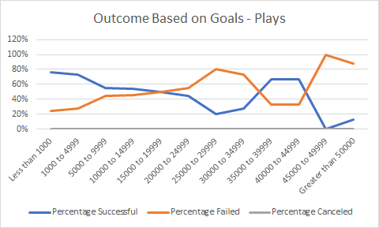
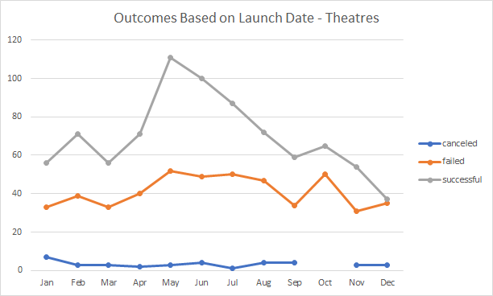

# Module 01 Challenge (Excel - Kickstarter analysis)

## Background
*Louise’s play Fever came close to its fundraising goal in a short amount of time. How many other Kickstarter campaigns were able to do this as well? In this challenge, you’ll conduct a data analysis to answer this question and determine whether the length of a campaign contributes to its ultimate success or failure.*

## Objectives
The goals of this challenge are for you to:

- Use filters and Excel formula to create new datasets
- Create visualizations using Excel charts and pivot tables
- Interpret the summary data provided from the visualizations

### Challenge
**Analysis**

**1. How many Kickstarter campaigns were able come *close* to meeting the fundraising goal in a *short amount of time*?**

*In order to perform this analysis, it is assumed that coming "close" to meeting the fundraising goal is a campaign with percentage funded within the range 80-99%, and a "short amount of time" is any campaign that ended under 31 days.*

*In total, only three other Kickstarter campaigns came close to meeting their fundraising goal in a short amount of time, with only one of the three being related to Theatre. Further analysis would be required to note any further similarities.*
*For more details, please see tab ANALYSIS 01 within the worksheet*

**2. Does the length of a campaign contribute to its ultimate success?**

*Average length of ALL successfull campaigns is 33 days, while average length of ALL canceled or failed campaigns is 35 days. Specifically for PLAYS, average length of successful campaigns is 29 days, while average length of failed campaigns (no cancelled campaigns noted) is 34 days, confirming that in either case, length of a campaign does not contribute to its ultimate success.*
*For more details, please see tab ANALYSIS 02 within the worksheet*

**Conclusions**

1. Kickstarter campaigns related to Plays with goals up to $5k overall have greatest chance of becoming successful (around 75% success rate), while between $5k and $20k still possess good odds at around 50% success rate.
2. Failed Theatre campaigns were fairly even throughout the year and never once surpassed successful Theatre campaigns. 
3. Most successful Theatre campaigns were launched in May, with slight downward trend from June to September. Worst month to launch is in December. All other months are relatively stable.

**Limitations**
- it is unclear what constitutes a "successful" campaign, as some campaigns outcome is "live" but their percentage funded is >100% and some campaign outcomes are "canceled" and their percentage funded is >100% therefore there are additional factors that ultimately qualifies a campaign as successful
- data set is as recent as 2017, therefore may not be fully reflective of the current year (2020) trends
- thorough analysis done only on Kickstarter campaigns that fall under the category of THEATRE, results may differ based on category

**Suggestions for Additional Tables/Graphs**
- geographic analysis - # of successful campaigns based on country
- YoY analysis by month - comparing goals, number of backers, average pledged to see if any trends between months and years

